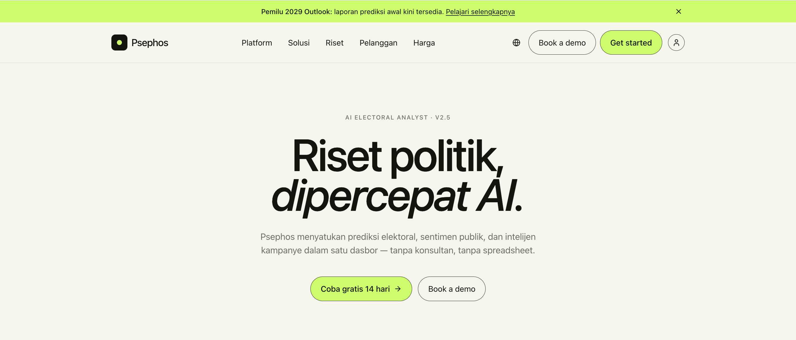

<p align="center">
  
</p>

<h1 align="center">🗳️ Psephos — AI Electoral Analyst</h1>

<p align="center">
  <strong>Platform SaaS riset politik bertenaga AI.</strong><br/>
  Prediksi elektoral • Analisis sentimen • Intelijen kampanye — dalam satu dasbor.
</p>

<p align="center">
  
  
  
</p>

---

## 🔭 Vision

Menjadi **single source of truth** data elektoral di Asia Tenggara, menggantikan spreadsheet dan konsultan manual dengan insight real-time berbasis AI.

## 🎯 Target Users

| Persona | Kebutuhan |
|---|---|
| Kepala Riset Partai | Forecasting per dapil, early warning narasi negatif |
| Staf Kampanye Kandidat | Monitoring sentimen harian, briefing pagi |
| Lembaga Survei | Cross-validasi hasil internal |
| Media / Jurnalis | Data elektoral terstruktur untuk pemberitaan |
| Akademisi | Akses API, dataset historis, backtesting |

## 🚀 MVP Features (Phase 1 — 8 weeks)

- **Forecasting per dapil** — Bayesian hierarchical model, 514 kab/kota, update tiap 6 jam
- **Sentimen harian** — NLP multibahasa (ID, Jawa, Sunda)
- **Media monitoring** — Scrape 50 outlet prioritas + X API
- **AI Co-pilot (chat)** — RAG-based Q&A via OpenRouter
- **Briefing harian email** — Ringkasan prediksi + sentimen + top narasi
- **Auth & Multi-tenant** — RBAC (Admin, Analyst, Viewer)
- **Dasbor utama** — Forecast map, sentiment trend, narasi card, alert panel

## 🏗️ Tech Stack

| Layer | Technology |
|---|---|
| Framework | [TanStack Start](https://tanstack.com/start) (React SSR) |
| Router | [TanStack Router](https://tanstack.com/router) |
| Data Fetching | [TanStack Query](https://tanstack.com/query) |
| UI Components | [shadcn/ui](https://ui.shadcn.com/) + [Radix UI](https://www.radix-ui.com/) |
| Styling | [Tailwind CSS v4](https://tailwindcss.com/) |
| Forms | [React Hook Form](https://react-hook-form.com/) + [Zod](https://zod.dev/) |
| Charts | [Recharts](https://recharts.org/) |
| Icons | [Lucide React](https://lucide.dev/) |
| Server | [Nitro](https://nitro.build/) (beta) |
| Language | TypeScript |
| Runtime | [Bun](https://bun.sh/) |

## 📂 Project Structure

```
src/
├── components/ui/    # 45+ shadcn/ui components
├── hooks/            # Custom React hooks
├── routes/           # File-based routes (TanStack Router)
├── routeTree.gen.ts  # Auto-generated route tree
├── router.tsx         # Router configuration
├── server.ts          # Nitro server entry
├── start.ts           # App entry point
└── styles.css         # Global styles (Tailwind)
docs/                  # PRD, FRD, BRD, TDD
```

## 🛠️ Getting Started

### Prerequisites

- [Bun](https://bun.sh/) >= 1.x

### Setup

```bash
# Clone repo
git clone https://github.com/sukirman1901/psephos.git
cd psephos

# Copy environment file
cp .env.example .env

# Install dependencies
bun install

# Start dev server
bun dev
```

App runs at `http://localhost:3000`.

### Scripts

| Command | Description |
|---|---|
| `bun dev` | Start development server |
| `bun run build` | Production build |
| `bun run build:dev` | Development build |
| `bun run preview` | Preview production build |
| `bun run lint` | Run ESLint |
| `bun run format` | Format with Prettier |

## 📖 Documentation

- [PRD — Product Requirements Document](docs/PRD.md)
- [FRD — Functional Requirements Document](docs/FRD.md)
- [BRD — Business Requirements Document](docs/BRD.md)
- [TDD — Technical Design Document](docs/TDD.md)

## 📊 Success Metrics (MVP Target)

| Metrik | Target |
|---|---|
| DAU (bulan ke-3) | 100 |
| Akurasi prediksi | >85% |
| Time-to-insight | <5 menit |
| Email open rate | >40% |
| NPS | >30 |

## ⚠️ Out of Scope (MVP)

- Quick count real-time (hari-H)
- SSO / OAuth enterprise (SAML)
- Multi-bahasa UI (hanya ID + EN)
- On-premise deployment
- Native mobile app
- Streaming data pipeline

## 📄 License

Private. All rights reserved.

---

<p align="center">Built with ❤️ for Southeast Asian democracy.</p>
